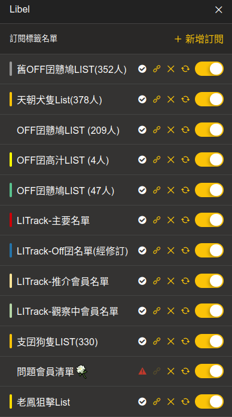

<p>
  <h1 align="center">Lihkg Libel Lists</h1>
  <p align="center">【<a href="https://kitce.github.io/libel/">Libel</a>】已公開的訂閱List名單</p>
  <p align="center">
     
  </p> 
</p>

***

## [OFF囝戇鳩LIST](https://bit.ly/lihkg_on9_list)

```
https://eat-play.github.io/on9_list/LIHKG-Label-List-power_off-1886.json
```
```
https://eat-play.github.io/on9_list/on9-data-1886.json
```
```
https://eat-play.github.io/on9_list/LIHKG-Label-List-2-power_off-1886.json
```

***

## [LITrack LIST](https://tiny.cc/LITrack_GS)

```
https://kinki-mochi.github.io/Main.json
```
```
https://kinki-mochi.github.io/Off.json
```
```
https://kinki-mochi.github.io/Inspection.jso
```
```
https://kinki-mochi.github.io/Recommendation.json
```

***

## [支囝狗隻LIST](https://lih.kg/ioxQqS)

```
https://raw.githubusercontent.com/shiaifglshav/ChiBoyDogList/main/ChiBoyDogList.json
```

***

## [問題會員清單](https://lihkg.com/thread/2841778/page/21?post=520)

```
https://v4kfdgew8t.github.io/rccnmlhnzv/questionableMemberList.json
```
老鳳狙擊list(#92230版)
```
https://v4kfdgew8t.github.io/xrsbkvnfay/LoFungList.json
```


***

## [老鳳狙擊list(Fork)](https://github.com/LibelLists/LoFungList)

```
https://libellists.github.io/LoFungList/LoFungList.json
```

***

## [Libel Web](https://libellists.github.io/LibelWeb)


內容來自以上各list及部份其他
